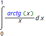
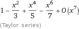
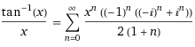

# Лабораторная работа №5: Численное интегрирование

Выполнил: Иванов А.А. Группа 426. Вариант 3.

###Задание

Вычислить несобственный интеграл с точностью 10E-4.
>

###Решение
Разложить в ряд Тейлора atan(x) и взять интегралл от каждого члена ряда 
>

###Итоговый ряд
>
>
>
>
>
>
***
####Решение интегралов находится в папке ans

>Запуск программы make -f makefile

